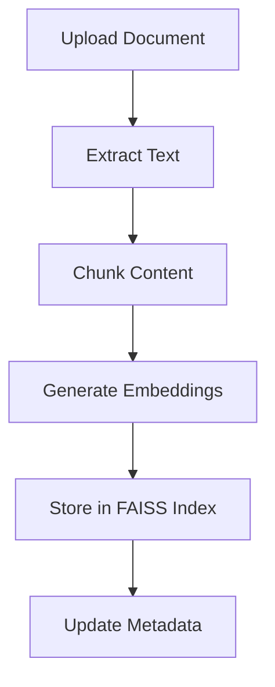
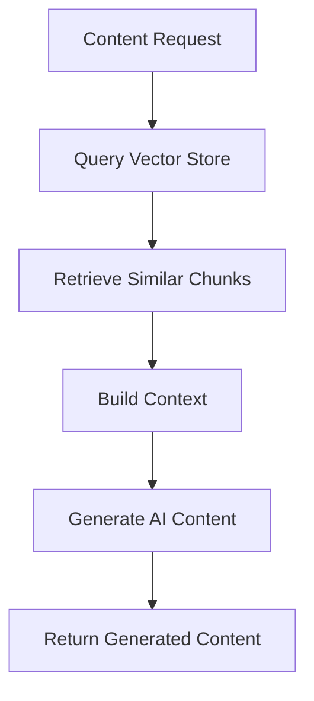

# RAG (Retrieval-Augmented Generation) Documentation

## 🎯 Overview

The RAG system in Operator Skills Hub enables intelligent content generation by combining document retrieval with AI generation. This allows the system to create contextually relevant educational content based on uploaded documents and course materials.

## 🏗️ Architecture

### Core Components

1. **Document Embedder** (`SimpleDocumentEmbedder`)
   - Converts documents into vector embeddings
   - Stores embeddings in FAISS index
   - Handles document chunking and metadata

2. **RAG Service** (`SimpleRAGService`)
   - Manages document processing workflow
   - Generates content using retrieved context
   - Handles course-specific content search

3. **Vector Storage** (FAISS)
   - High-performance similarity search
   - Local storage for privacy
   - Optimized for construction industry content

## 📚 How RAG Works

### 1. Document Processing Pipeline



### 2. Content Generation Pipeline



## 🔧 Configuration

### Environment Variables

```bash
# Vector Store Configuration
VECTOR_STORE_PATH=data/vector_store
VECTOR_DIMENSION=384
VECTOR_INDEX_TYPE=faiss

# AI Model Configuration
AI_MODEL=gpt-3.5-turbo
AI_MAX_TOKENS=2000
AI_TEMPERATURE=0.7
AI_EMBEDDING_MODEL=all-MiniLM-L6-v2
```

### Settings in `app/core/config.py`

```python
# Vector Store Configuration
vector_store_path: str = "data/vector_store"
vector_dimension: int = 384
vector_index_type: str = "faiss"

# AI Model Configuration
ai_model: str = "gpt-3.5-turbo"
ai_max_tokens: int = 2000
ai_temperature: float = 0.7
ai_embedding_model: str = "all-MiniLM-L6-v2"
```

## 🚀 Usage Examples

### 1. Basic Document Processing

```python
from app.services.simple_rag_service import SimpleRAGService
from app.core.database import get_db

# Initialize RAG service
db = next(get_db())
rag_service = SimpleRAGService(db)

# Process uploaded document
result = rag_service.process_uploaded_document(
    content_id=123,
    instructor_id=456
)

print(f"Status: {result['status']}")
print(f"Chunks created: {result.get('chunks_created', 0)}")
```

### 2. Content Generation with RAG

```python
# Generate learning material using RAG
content = rag_service.generate_course_content(
    course_id=1,
    instructor_id=1,
    content_type="learning_material",
    title="Construction Safety",
    description="Safety procedures for construction workers",
    additional_instructions="Focus on UK standards and CITB requirements",
    use_rag=True
)

print(f"Generated content: {content['content']}")
print(f"Sources used: {content['sources_used']}")
```

### 3. Document Search

```python
# Search for relevant content
search_results = rag_service.search_course_content(
    course_id=1,
    query="safety procedures",
    top_k=5
)

for result in search_results:
    print(f"Score: {result['score']}")
    print(f"Content: {result['content'][:100]}...")
```

## 📊 Document Types Supported

### 1. PDF Documents
- **Extraction**: PyPDF2 for text extraction
- **Processing**: Automatic chunking and embedding
- **Metadata**: Title, description, course association

### 2. Text Content
- **Direct processing**: No extraction needed
- **Chunking**: Intelligent text splitting
- **Context preservation**: Maintains document structure

### 3. Course Materials
- **Integration**: Links to course content
- **Versioning**: Tracks document updates
- **Access control**: Instructor-specific processing

## 🔍 Vector Search Features

### Similarity Search
- **Cosine similarity**: Measures content relevance
- **Top-K retrieval**: Configurable result count
- **Score filtering**: Quality-based result selection

### Chunking Strategy
- **Size**: 500 characters per chunk
- **Overlap**: 50 characters between chunks
- **Preservation**: Maintains context across chunks

### Metadata Storage
```json
{
    "document_id": "doc_123",
    "chunk_index": 0,
    "content": "Safety procedures...",
    "metadata": {
        "course_id": 1,
        "instructor_id": 456,
        "title": "Safety Manual",
        "description": "Construction safety procedures",
        "content_type": "pdf",
        "created_at": "2024-01-01T00:00:00Z"
    }
}
```

## 🎯 Content Generation Types

### 1. Learning Materials
- **Structure**: Clear sections and objectives
- **Context**: Based on uploaded documents
- **Standards**: UK construction regulations
- **Format**: Markdown with proper headings

### 2. Lesson Plans
- **Activities**: Hands-on exercises
- **Timing**: Detailed schedule breakdown
- **Materials**: Required resources and documents
- **Assessment**: Knowledge checks and evaluations

### 3. Knowledge Tests
- **Questions**: Multiple choice with explanations
- **Randomisation**: Answer positions randomised
- **Length**: Similar-length answer options
- **Standards**: UK construction terminology

## 🔧 API Endpoints

### Document Processing

```http
POST /api/ai/process-document
Content-Type: application/json

{
    "content_id": 123,
    "instructor_id": 456
}
```

**Response:**
```json
{
    "status": "success",
    "document_id": "doc_123",
    "chunks_created": 15,
    "message": "Document successfully processed and embedded"
}
```

### Content Generation

```http
POST /api/ai/generate-content
Content-Type: application/json

{
    "content_type": "learning_material",
    "title": "Construction Safety",
    "description": "Basic safety principles",
    "course_id": 1,
    "additional_instructions": "Focus on UK standards",
    "use_rag": true
}
```

**Response:**
```json
{
    "status": "success",
    "content": "Generated content...",
    "content_type": "learning_material",
    "generation_id": 789,
    "sources_used": 5,
    "model_used": "gpt-3.5-turbo"
}
```

### Content Search

```http
GET /api/ai/search-content?course_id=1&query=safety&top_k=5
```

**Response:**
```json
[
    {
        "score": 0.85,
        "content": "Safety procedures for construction...",
        "document_id": "doc_123",
        "chunk_index": 2,
        "metadata": {
            "title": "Safety Manual",
            "course_id": 1
        }
    }
]
```

## 🛠️ Advanced Configuration

### Custom Embedding Models

```python
# In app/core/config.py
ai_embedding_model: str = "all-MiniLM-L6-v2"  # Default
# ai_embedding_model: str = "all-mpnet-base-v2"  # Alternative
```

### Chunking Parameters

```python
# In app/services/simple_rag_service.py
def _chunk_text(self, text: str, chunk_size: int = 500, overlap: int = 50):
    # Customize chunking strategy
    pass
```

### Search Parameters

```python
# Adjust search sensitivity
search_results = embedder.search_similar_content(
    query="safety procedures",
    top_k=10  # Increase for more results
)
```

## 📈 Performance Optimization

### 1. Index Optimization
- **FAISS Index**: Optimized for similarity search
- **Memory usage**: Efficient vector storage
- **Query speed**: Sub-millisecond search times

### 2. Chunking Strategy
- **Size balance**: 500 chars for context vs. performance
- **Overlap**: 50 chars for context preservation
- **Boundary detection**: Respects sentence boundaries

### 3. Caching
- **Vector cache**: Reuse computed embeddings
- **Result cache**: Cache frequent queries
- **Metadata cache**: Fast metadata access

## 🔒 Security & Privacy

### Data Protection
- **Local storage**: Vectors stored locally
- **No external sharing**: Documents stay private
- **Access control**: Instructor-specific access
- **Encryption**: Secure storage of sensitive data

### Content Validation
- **Human review**: All generated content reviewed
- **Approval workflow**: Multi-step content approval
- **Version control**: Track content changes
- **Quality checks**: Automated content validation

## 🧪 Testing & Debugging

### Test Document Processing

```python
# Test document embedding
from app.services.simple_rag_service import SimpleDocumentEmbedder

embedder = SimpleDocumentEmbedder()
success = embedder.embed_document(
    content="Test construction safety content",
    document_id="test_doc",
    metadata={"title": "Test Document"}
)
print(f"Embedding success: {success}")
```

### Test Content Search

```python
# Test search functionality
results = embedder.search_similar_content("safety procedures", top_k=3)
for result in results:
    print(f"Score: {result['score']:.3f}")
    print(f"Content: {result['content'][:100]}...")
```

### Debug Vector Store

```python
# Check vector store status
import os
from pathlib import Path

vector_path = Path("data/vector_store")
print(f"Vector store exists: {vector_path.exists()}")
print(f"Index file exists: {(vector_path / "faiss_index.bin").exists()}")
print(f"Metadata file exists: {(vector_path / "metadata.json").exists()}")
```

## 📊 Monitoring & Analytics

### Performance Metrics
- **Processing time**: Document embedding speed
- **Search latency**: Query response times
- **Storage usage**: Vector store size
- **Hit rate**: Successful content retrieval

### Content Analytics
- **Generation success**: AI content generation rate
- **Source usage**: Most referenced documents
- **Quality scores**: Content approval rates
- **User engagement**: Content interaction metrics

## 🚨 Troubleshooting

### Common Issues

1. **Document Processing Fails**
   - Check file permissions
   - Verify PDF text extraction
   - Ensure sufficient disk space

2. **Search Returns No Results**
   - Verify document embedding
   - Check query similarity
   - Ensure vector store exists

3. **Content Generation Errors**
   - Check OpenAI API key
   - Verify model availability
   - Review content length limits

### Debug Commands

```bash
# Check vector store
ls -la data/vector_store/

# Test database connection
python -c "from app.core.database import test_connection; test_connection()"

# Test RAG service
python -c "from app.services.simple_rag_service import SimpleRAGService; print('RAG service loaded')"
```

## 🔄 Maintenance

### Regular Tasks

1. **Vector Store Backup**
   ```bash
   cp -r data/vector_store/ backups/vector_store_$(date +%Y%m%d)/
   ```

2. **Index Optimization**
   ```python
   # Rebuild index if needed
   embedder._create_new_index()
   ```

3. **Storage Cleanup**
   ```bash
   find data/vector_store/ -name "*.tmp" -delete
   ```

### Updates

1. **Model Updates**: Update embedding models
2. **Index Migration**: Migrate to new FAISS versions
3. **Schema Changes**: Update metadata structure
4. **Performance Tuning**: Optimize chunking and search

## 📚 Best Practices

### Document Preparation
1. **Quality**: Use high-quality, well-formatted documents
2. **Relevance**: Ensure documents match course content
3. **Completeness**: Include all necessary sections
4. **Standards**: Follow UK construction standards

### Content Generation
1. **Context**: Provide clear, specific instructions
2. **Review**: Always review generated content
3. **Customization**: Adapt content to specific needs
4. **Standards**: Maintain UK English throughout

### Performance
1. **Chunking**: Optimize chunk size for your content
2. **Indexing**: Regular index maintenance
3. **Caching**: Implement appropriate caching
4. **Monitoring**: Track performance metrics

---

**The RAG system provides powerful document processing and content generation capabilities while maintaining security, privacy, and quality standards for construction industry training.**

